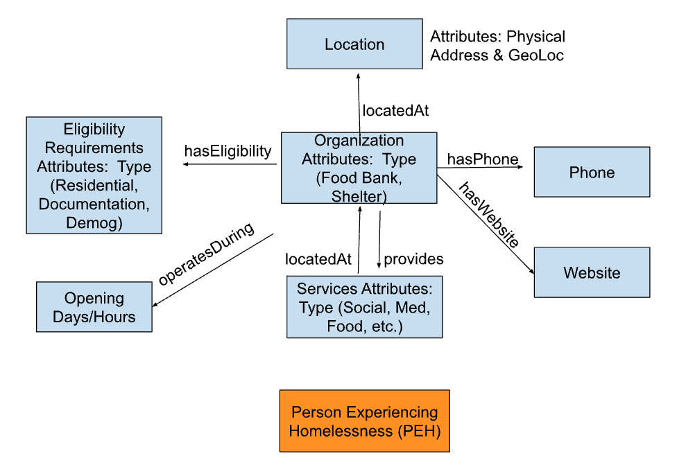
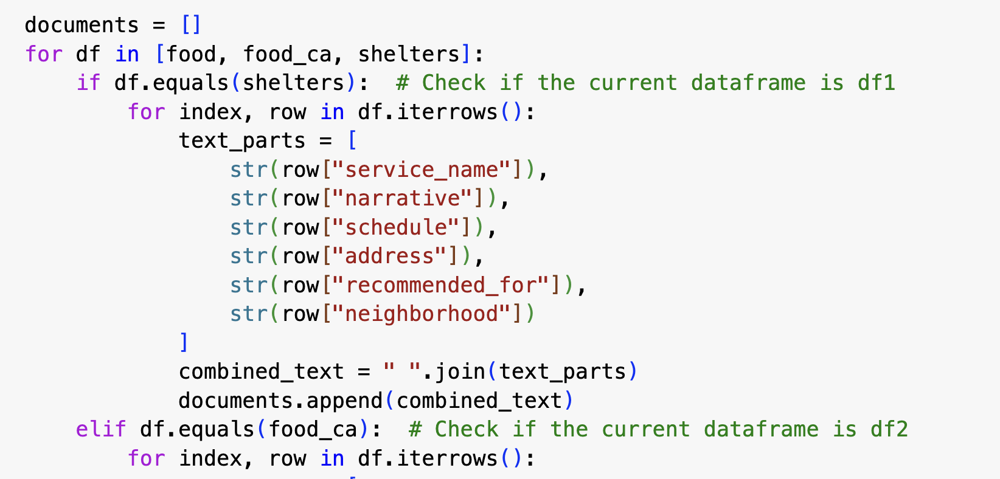
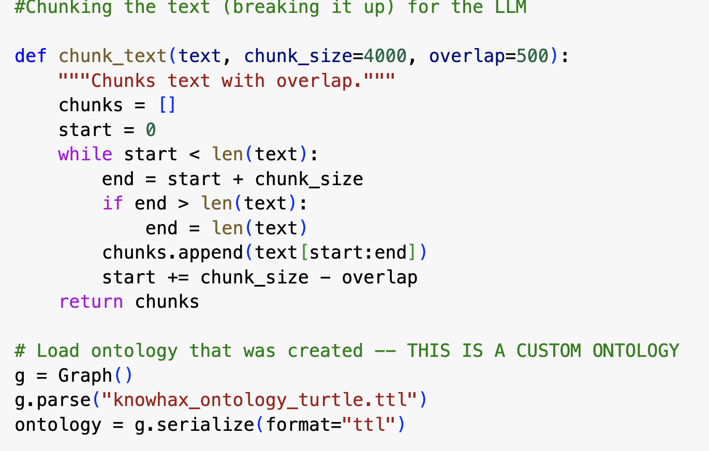
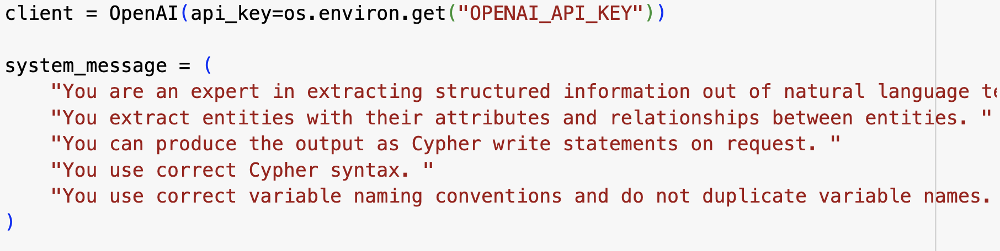
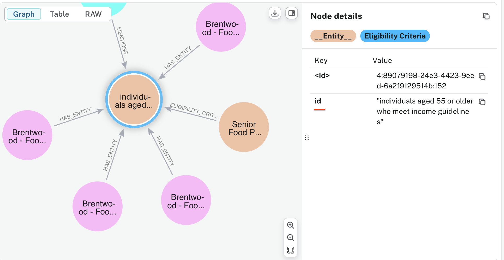
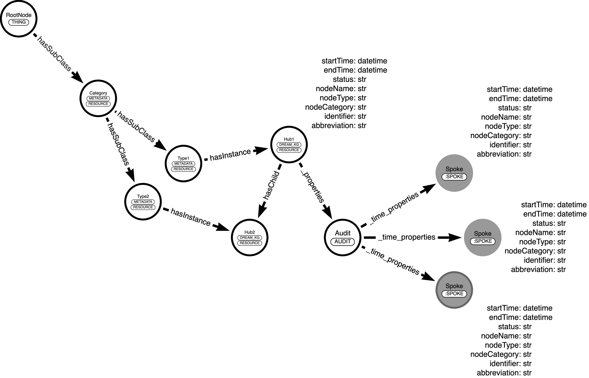
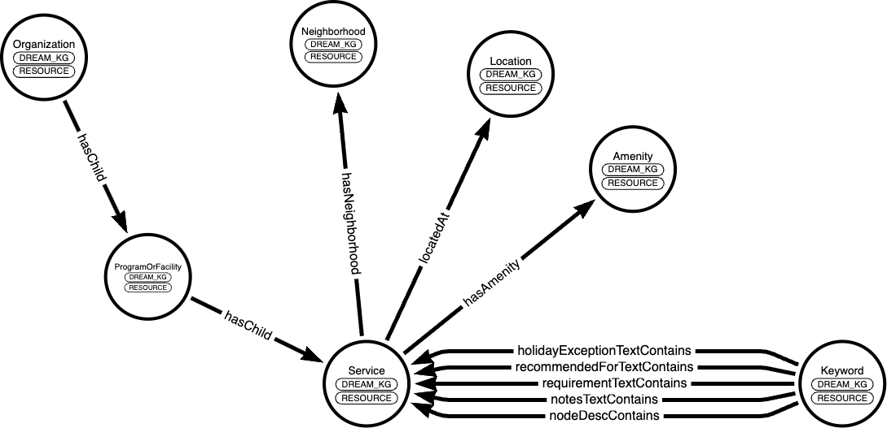
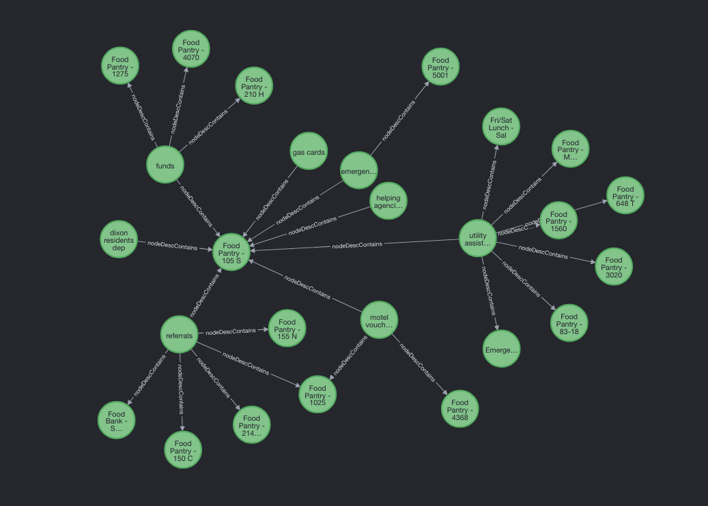
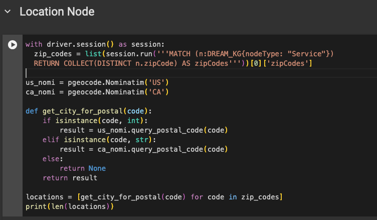
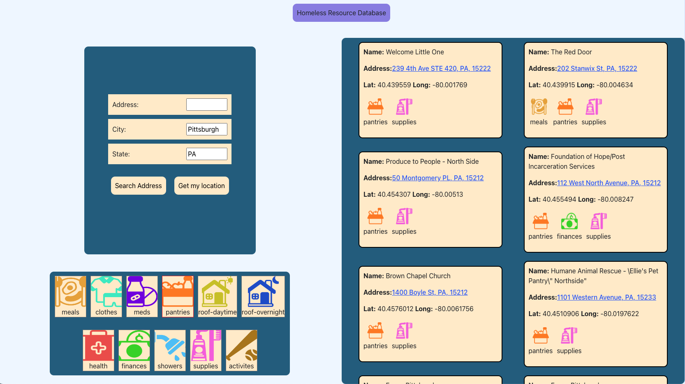

# Homelessness Navigator: Creating a Knowledge Graph and User-Centric UI/UX Design for Social Services and Living Resources 

## Project Overview 
The Homelessness Navigator project aims to create a foundational knowledge graph that connects people experiencing homelessness (PEH) with essential services such as shelters,food banks, and social services. By leveraging foundational knowledge graph techniques, the project seeks to facilitate easy access to information, enabling users to find the resources they need quickly and efficiently.  This project was sponsored by [KnowHax](https://app.knowhax.com/challenge_pop-hack/1727888126435x823821229288511500) and the research started by [Temple University](https://www.nsf.gov/awardsearch/showAward?AWD_ID=2333703&HistoricalAwards=false) under Dr. Yuzhou Chen.  

## Potential Stakeholders
The success of the Homelessness Navigator project depends on the collaboration of various stakeholders, including People Experiencing Homelessness (PEH), who will provide insights to shape the platform; case workers, who can enhance their support using the knowledge graph; and non-profit organizations that will contribute data and promote the platform. Federal agencies like the U.S. Interagency Council on Homelessness can lend legitimacy and resources, while local governments facilitate access to local data and integration into services. Additionally, community members can raise awareness and offer local insights. Together, these stakeholders will help create a comprehensive resource empowering individuals experiencing homelessness to access essential services.

## Key Project Features 
- Knowledge Graph Development: The project will construct a dynamic knowledge graph that integrates various data sources related to homelessness services. This graph will include information on locations, availability, eligibility criteria, and user reviews of shelters and food banks.
  
- User-Centric UX/UI Design: A focus will be placed on designing an intuitive user interface that caters specifically to the needs of homeless individuals. The design will prioritize simplicity and accessibility, ensuring that users can navigate the platform with ease, regardless of their technological proficiency.  The design will be more of a prototype and initial starting point that can be refined with further iterations of the project.
  
- Search Functionality: The platform will feature a search engine that allows users to query the knowledge graph effectively. Users will be able to search for services based on their immediate needs, such as "shelters near me" or "food banks open today."  

## Data
Sample shelter and food bank datasets were provided by Dr. Chen that spanned across Pennsylvania, California, and British Columbia.  Key features include, but are not limited to, the following:

- Shelter/Food Bank's name, location, website
- Unstructured Notes/Description columns that could include additional information such as operating hours, income restrictions, specific resources (warm meals), etc.

One of the considerations of this project is to pull out important information from the unstructured text column that can enhance Knowledge Graph and UI searchability and overall user experience. 

## Ontology
[Web Protege](https://webprotege.stanford.edu/) desktop was used to map out the classes, object properties, data properties, and instances.  This image was created and used to develop the ontology:

## Knowledge Graph (LLM) 
Two knowledge graphs were created for the project.  The first knowledge graph focused on preparing a text document from the static files, reading in the custom ontology turtle file, and using an OpenAI API environment to generate a Cypher Script.  Here is some snapshots of the code (Full Code Can be Found [Here](notebooks/LLMKnowledgeGraphCode.ipynb):

1. Creating a document.txt file from the 3 CSV files given

2. Chunking up the document.txt file and creating a Graph object to read in custom ontology

3. Giving the LLM a specific system message and prompt to produce Cypher code that then can be read into Neo4j

4. Post-processing the text to make a Knowledge Graph on Neo4j Aura.  In this image it is showing the age eligibility requirement for a Senior Food Program. 

## Knowledge Graph (non-LLM approach) 
The ontology, parent-child nodes, data cleanup were all done manually.  After the nodes and relationships were created, a final graph was displayed. View full code [Here](notebooks/DREAM-KG Mod 2.ipynb).

1. Hub-Spoke Graph Data Model - Supports metadata management, including cardinality constraints, hierarchy representation, and node-type-specific property configurations. It also incorporates auditing capabilities, where each spoke entity captures a snapshot of the hub before any modifications, ensuring a record of changes for traceability.

2. DreamKG Homelessness Graph Data Model

3. Python NLP toolkit used to extract information such as amenities, eligibility criteria, and requirements from text by leveraging techniques like named entity recognition (NER), keyword extraction, and text classification.

4. Location data enrichment using the pgeocode Python module is an efficient way to extract geographical details such as latitude, longitude, city, state, or country from postal codes. This enhances the dataset by linking textual information to precise locations, which is valuable for visualization, reporting, or further geospatial analysis.

5. NeoDash dashboard is built on top of the KG to enable search capabilities.

## UX/UI Design

### End User Story 

### Interface Images 

Link to deployed User Interface, [Homeless Resource Database](homeless-resource.surge.sh)

## Recommendations & Insights 

1.  Although an LLM can take a custom ontology and generate Cypher code needed for a Knowledge Graph, automatic post-processing of the code would need to happen in order for the Cypher code to work.  Recommend building out this automation.
2.  A manual knowledge graph approach can include more granualarity; however, handling "time features" is cubbersome
3.  

## Future Steps 

1.  Our Knowledge Graph and UX/UI design was purely focused on People Experiencing Homelessness (PEH) we would like to expand it to government stakeholders as well
2.  Refining our ontology is an ongoing process and would need to be updated as new data comes in
3.  The UX/UI design will be updated for enhanced functionality and to expand across multiple end-user stories

## Additional Analysis 
### Benefit Analysis 

## Contributors 
- Name:  Angelica Spratley (Jelly)  Project Role:  Technical and Knowledge Graph Lead  LinkedIn: [LinkedIn](https://linkedin.com/in/angelicaspratley)
- Name:  Garrett Smith  Project Role:  Business and Project Mgmt Lead  LinkedIn: [LinkedIn](https://linkedin.com/in/garrett55smith)
- Name:  Grazia Maszak-Prato  Project Role: UX/UI Lead LinkedIn: [LinkedIn](https://linkedin.com/in/graziaprato)
- Name:  Vijaya Sekar  Project Role:  Technical and Knowledge Graph Lead LinkedIn: [LinkedIn](https://linkedin.com/in/vijaya-sekar)
- Name:  Robert Yates Project Role:  Additional Analysis [LinkedIn](https://www.linkedin.com/in/rwyates/)
- Name:  Will Isenberg Project Role:  Front-End UI Designer  LinkedIn: [LinkedIn](https://www.linkedin.com/in/will-isenberg/) 
